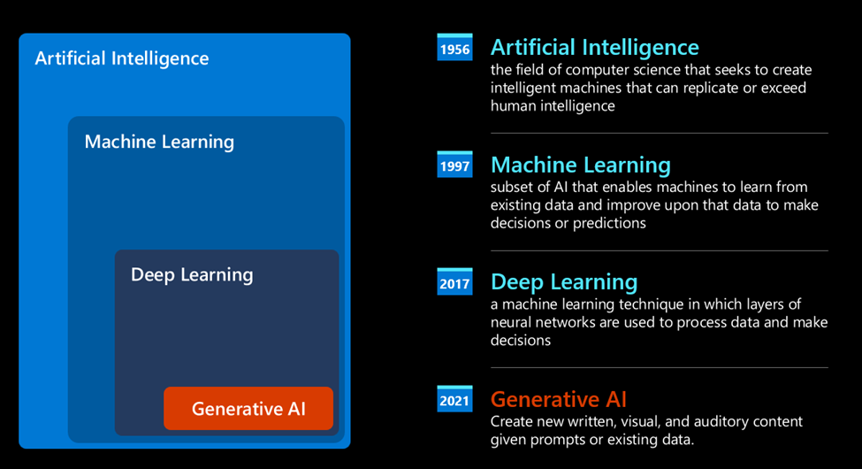

# Lesson 01 Introduction to Generative AI and Large Language Models
To get started, focus on designing intuitive interfaces that accept natural language inputs, eliminating the need for specialized programming knowledge. With a simple text prompt, users can harness the capabilities of AI models to generate reports, craft applications, and accomplish a myriad of tasks in mere seconds. To build such an application, employ a robust technical stack comprising frontend frameworks like React, Angular, or Vue.js, backend frameworks like Node.js, Django, or Flask, and AI libraries like TensorFlow, PyTorch, or Keras. Ensure seamless communication between components using APIs and data integration tools like GraphQL, REST, or Apache Kafka. By following this comprehensive guide, you'll be well on your way to developing a cutting-edge Agentic AI app that transforms the way users interact with AI, making it more accessible, intuitive, and powerful than ever before.

## Evolution of GenAI
After decades of research in the AI field, a new model architecture – called Transformer – overcame the limits of RNNs, being able to get much longer sequences of text as input. Transformers are based on the attention mechanism, enabling the model to give different weights to the inputs it receives, ‘paying more attention’ where the most relevant information is concentrated, regardless of their order in the text sequence.

Most of the recent generative AI models – also known as Large Language Models (LLMs), since they work with textual inputs and outputs – are indeed based on this architecture. What’s interesting about these models – trained on a huge amount of unlabeled data from diverse sources like books, articles and websites – is that they can be adapted to a wide variety of tasks and generate grammatically correct text with a semblance of creativity. So, not only did they incredibly enhance the capacity of a machine to ‘understand’ an input text, but they enabled their capacity to generate an original response in human language.

