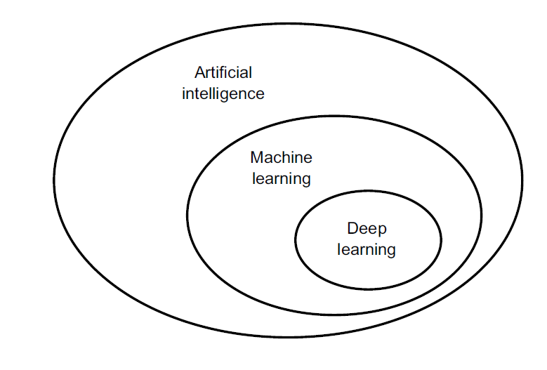
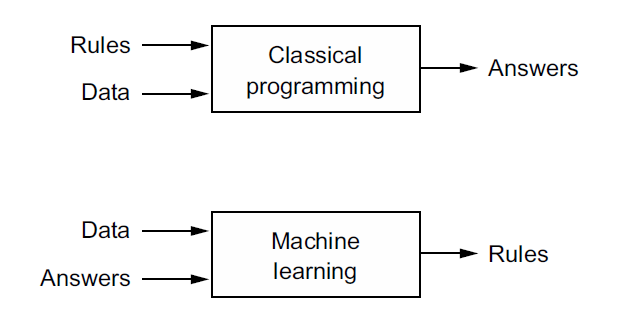
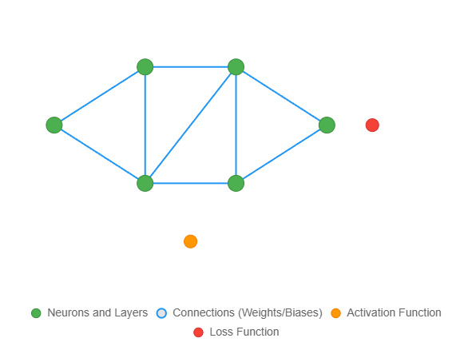

# Lesson 1 Introduction to Deep Learning

**Artificial Intelligence (AI)**, Machine Learning (ML), and Deep Learning (DL) are interconnected fields driving transformative advancements in technology. AI is the broadest concept, encompassing systems or machines that mimic human intelligence to perform tasks such as reasoning, problem-solving, and decision-making. It includes a wide range of techniques, from rule-based systems to advanced algorithms, enabling machines to perceive, learn, and interact with their environment. 
Concisely, AI can be described as ***the effort to automate intellectual tasks normally performed
by humans.***

**Machine Learning**, a subset of AI, focuses on algorithms that allow computers to learn from and make predictions or decisions based on data, without explicit programming. ML includes methods like supervised learning (e.g., regression, classification), unsupervised learning (e.g., clustering), and reinforcement learning, leveraging statistical models to identify patterns. 

**Deep Learning**, a specialized subset of ML, utilizes artificial neural networks with multiple layers to process complex data, excelling in tasks like image and speech recognition. DL's strength lies in its ability to automatically extract features from raw data, enabling breakthroughs in applications like autonomous vehicles and natural language processing. Together, AI, ML, and DL form a hierarchy of increasingly sophisticated approaches, revolutionizing industries by enabling intelligent, data-driven solutions.

## Deep Learning Building Blocks

**Deep Learning (DL)** relies on several fundamental building blocks that enable neural networks to model complex patterns and solve intricate tasks. The core component is the **artificial neuron**, which processes inputs by applying weights, biases, and an activation function to produce an output, mimicking biological neurons. **Neural networks** are structured in layers, including an input layer, hidden layers, and an output layer, with each layer comprising multiple neurons that transform data hierarchically. **Weights and biases** are learnable parameters adjusted during training to minimize prediction errors, typically optimized using gradient-based methods like backpropagation and stochastic gradient descent. **Activation functions**, such as ReLU, sigmoid, or tanh, introduce non-linearity, enabling networks to model complex relationships. **Loss functions**, like mean squared error or cross-entropy, quantify the difference between predicted and actual outputs, guiding optimization. **Convolutional layers** (in CNNs) and **recurrent layers** (in RNNs) are specialized for spatial and sequential data, respectively, while **attention mechanisms** and **transformers** enhance modeling of long-range dependencies in tasks like natural language processing. **Regularization techniques**, such as dropout and batch normalization, prevent overfitting and stabilize training. Together, these components form the foundation of deep learning, enabling robust solutions across domains like computer vision and speech recognition.

### 1. Artificial Neuron
An artificial neuron, the fundamental unit of a neural network, emulates the behavior of biological neurons by processing input data to produce an output. It receives multiple inputs, each multiplied by a corresponding weight, which adjusts the input’s influence. These weighted inputs are summed, and a bias term is added to shift the result, allowing the neuron to model a wider range of functions. The summed value is then passed through an activation function (e.g., ReLU, sigmoid) to introduce non-linearity, enabling the neuron to capture complex patterns. During training, weights and biases are optimized to minimize errors. Artificial neurons are interconnected in layers, forming the backbone of deep learning models, and their collective behavior enables tasks like classification and regression.

### 2. Neural Network Layers
Neural network layers are structured collections of artificial neurons organized into input, hidden, and output layers. The input layer receives raw data (e.g., pixel values for images), passing it to one or more hidden layers where complex transformations occur through weighted connections and activation functions. Hidden layers extract features, such as edges in images or patterns in sequences, with deeper layers capturing increasingly abstract representations. The output layer produces the final prediction or classification, such as a class label or numerical value. The number and size of layers determine the network’s capacity, with deeper networks handling more complex tasks but requiring more data and computation. Layers are interconnected, and their parameters are tuned during training via backpropagation.

### 3. Weights and Biases
Weights and biases are the learnable parameters of a neural network, critical for modeling relationships in data. Weights are multipliers applied to input values, determining their contribution to the neuron’s output; higher weights amplify an input’s influence, while lower weights diminish it. Biases are additive terms that shift the weighted sum, allowing the model to better fit data by adjusting the activation threshold. During training, backpropagation and optimization algorithms (e.g., stochastic gradient descent) iteratively adjust weights and biases to minimize the loss function. Proper initialization (e.g., Xavier or He initialization) and regularization prevent issues like vanishing gradients or overfitting, ensuring robust learning.

### 4. Activation Functions
Activation functions introduce non-linearity into neural networks, enabling them to model complex, non-linear relationships in data. Common functions include ReLU (Rectified Linear Unit, outputting max(0, x)), which is computationally efficient and mitigates vanishing gradient issues; sigmoid (mapping inputs to [0,1]), suitable for binary classification; and tanh (mapping to [-1,1]), useful for centered data. Others, like softmax, are used in output layers for multi-class classification. Activation functions are applied to the weighted sum of inputs plus bias in each neuron, determining whether and how strongly a neuron fires. Choosing the right function depends on the task and network architecture.

### 5. Loss Functions
Loss functions quantify the difference between a neural network’s predictions and the actual target values, guiding the optimization process. Common loss functions include mean squared error (MSE) for regression tasks, measuring the squared difference between predicted and true values; cross-entropy loss for classification, penalizing incorrect class probabilities; and hinge loss for support vector machines. The choice of loss function depends on the task (e.g., regression vs. classification) and data distribution. During training, the network minimizes the loss using gradient-based optimization, ensuring predictions align closely with ground truth.

### 6. Convolutional Layers
Convolutional layers, used in Convolutional Neural Networks (CNNs), are designed for spatial data like images. They apply learnable filters (kernels) to input data, performing convolution operations to detect features such as edges, textures, or objects. Each filter slides over the input, producing feature maps that highlight specific patterns. Parameters like filter size, stride, and padding control the output dimensions. Pooling layers (e.g., max pooling) often follow, reducing spatial dimensions while preserving important features, improving computational efficiency and reducing overfitting. Convolutional layers excel in tasks like image classification and object detection due to their ability to learn hierarchical feature representations.

### 7. Recurrent Layers
Recurrent layers, used in Recurrent Neural Networks (RNNs), are designed for sequential data like time series or text. They maintain a hidden state that captures information from previous time steps, allowing the network to model temporal dependencies. Variants like LSTMs (Long Short-Term Memory) and GRUs (Gated Recurrent Units) address vanishing gradient issues by using gates to selectively remember or forget information over long sequences. Recurrent layers process inputs sequentially, updating the hidden state at each step, and are ideal for tasks like speech recognition and language modeling, though they can be computationally intensive.

### 8. Attention Mechanisms
Attention mechanisms enhance neural networks by focusing on relevant parts of the input data, particularly in tasks like natural language processing. They assign weights to different input elements based on their importance to the current context, allowing the model to prioritize critical information. The self-attention mechanism, used in transformers, computes similarity scores between all input tokens, enabling the model to capture long-range dependencies efficiently. Components include query, key, and value vectors, with attention scores derived from their dot products. Attention mechanisms are computationally intensive but highly effective in tasks like machine translation and text generation.

### 9. Transformers
Transformers are a powerful deep learning architecture, primarily used in natural language processing and computer vision, that leverage attention mechanisms to model relationships between input elements efficiently. Introduced in the 2017 paper "Attention is All You Need," transformers rely on self-attention to weigh the importance of each input token relative to others, capturing long-range dependencies without the sequential processing limitations of recurrent neural networks. They consist of an encoder-decoder structure: the encoder processes input data into contextual representations, while the decoder generates outputs, such as translated text or predictions. Key components include multi-head attention, which allows the model to focus on different aspects of the input simultaneously, and feedforward neural networks applied to each token. Positional encodings are added to account for the order of inputs, as transformers lack inherent sequential awareness. Layer normalization and residual connections stabilize training, enabling deep architectures. Transformers power models like BERT and GPT, achieving state-of-the-art performance in tasks like translation, text generation, and image classification, due to their scalability and parallelization capabilities.

### 10. Regularization Techniques
Regularization techniques prevent overfitting in neural networks by constraining model complexity. Dropout randomly deactivates a fraction of neurons during training, forcing the network to learn robust, distributed representations. Batch normalization normalizes layer inputs to stabilize and accelerate training, reducing sensitivity to initialization. L2 regularization (weight decay) adds a penalty to large weights, encouraging simpler models. Data augmentation artificially expands the training dataset by applying transformations (e.g., rotations for images). These techniques ensure models generalize well to unseen data, balancing bias and variance.

## What Makes Deep Learning Different
Deep learning stands out from traditional machine learning and other artificial intelligence approaches due to its ability to automatically learn hierarchical feature representations from raw data, eliminating the need for manual feature engineering. Unlike classical machine learning methods, such as decision trees or linear regression, which rely on hand-crafted features and shallow architectures, deep learning employs multi-layered neural networks—often with dozens or hundreds of layers—to capture complex patterns and abstractions directly from high-dimensional inputs like images, audio, or text. This is enabled by building blocks like artificial neurons, convolutional and recurrent layers, and attention mechanisms, which process data through non-linear transformations, optimized via backpropagation and gradient-based methods. Deep learning’s strength lies in its scalability with large datasets and computational power, allowing it to excel in tasks like image recognition, natural language processing, and autonomous systems. However, it demands substantial data and computational resources, and its models can be less interpretable compared to simpler algorithms, making regularization techniques and careful architecture selection critical to prevent overfitting and ensure generalization.

## Technical Infrastructure
The technical infrastructure for deep learning application development encompasses several interconnected components to facilitate efficient model design, training, and deployment.
**Hardware** forms the foundation, with high-performance GPUs (e.g., NVIDIA A100) or TPUs (e.g., Google Cloud TPU v4) accelerating matrix computations critical for neural network training, often supported by high-memory CPUs and large-scale storage systems for handling massive datasets.
**Data infrastructure** includes data collection pipelines (e.g., web scraping, IoT sensors), preprocessing tools for cleaning and augmenting data (e.g., normalization, tokenization), and storage solutions like cloud-based object stores (e.g., AWS S3) or databases (e.g., MongoDB) for managing structured and unstructured data. 
**Software frameworks** such as TensorFlow, PyTorch, or JAX provide flexible APIs for building and training models, with support for automatic differentiation and distributed computing. 
**Development environments** like Jupyter Notebooks, integrated development environments (e.g., PyCharm), or cloud-based platforms (e.g., Google Colab, AWS SageMaker) streamline coding and experimentation. 
**Training infrastructure** leverages distributed computing frameworks (e.g., Horovod, Ray) for parallelizing training across multiple GPUs or clusters, with hyperparameter tuning tools (e.g., Optuna) optimizing model performance. 
**Model evaluation** involves metrics computation (e.g., accuracy, F1-score) and visualization tools (e.g., Matplotlib, TensorBoard) for performance analysis. 
**Deployment infrastructure** includes model serving platforms (e.g., TensorFlow Serving, ONNX Runtime) for real-time inference, containerization tools like Docker for portability, and orchestration systems like Kubernetes for scaling. 
**Cloud services** (e.g., AWS, Azure, GCP) provide scalable compute and storage, while **MLOps pipelines** (e.g., MLflow, Kubeflow) automate workflows for continuous integration, deployment, and monitoring. **Security and governance** ensure data privacy (e.g., differential privacy) and model robustness, while **version control systems** (e.g., Git) manage code and model artifacts. This infrastructure enables developers to build robust, scalable deep learning applications tailored to specific use cases.

## Deep Learning Applications
Deep learning has revolutionized numerous fields by enabling applications that leverage its capacity to process high-dimensional data, such as images, audio, text, and time-series, through multi-layered neural networks. In computer vision, deep learning powers image classification (e.g., identifying objects in photos), object detection (e.g., locating and labeling objects in images), and facial recognition systems used in security and social media. Natural language processing (NLP) applications include machine translation (e.g., Google Translate), sentiment analysis for social media monitoring, and chatbots or virtual assistants like Siri and Alexa, driven by models like transformers. In speech and audio processing, deep learning enables speech recognition (e.g., transcribing audio to text), text-to-speech synthesis, and music generation. Healthcare applications include medical image analysis for diagnosing diseases from X-rays or MRIs, drug discovery through molecular modeling, and personalized treatment predictions. Autonomous systems, such as self-driving cars and drones, use deep learning for real-time object detection, path planning, and sensor fusion. In finance, it supports fraud detection, algorithmic trading, and credit risk assessment by analyzing transaction patterns. Gaming and entertainment benefit from deep learning through AI-driven non-player characters, procedural content generation, and recommendation systems for platforms like Netflix. Robotics leverages deep learning for tasks like grasp planning and human-robot interaction. Additionally, deep learning enhances scientific research by modeling complex systems in physics, biology, and climate science, and powers creative applications like generating art, writing, or video content. These applications rely on deep learning’s building blocks—convolutional neural networks (CNNs), recurrent neural networks (RNNs), transformers, and reinforcement learning—tailored to specific data types and tasks, with scalability driven by large datasets and computational advancements.

**Specific Examples of Deep Learning Applications**

- **Image Classification**: Classifying images into categories (e.g., identifying cats vs. dogs) using CNNs, as seen in apps like Google Photos.
- **Object Detection**: Identifying and localizing objects in images or videos (e.g., YOLO for real-time detection in autonomous vehicles).
- **Facial Recognition**: Authenticating users or tagging people in photos, used in smartphone unlocking or surveillance systems.
- **Machine Translation**: Translating text between languages using transformer models, like Google Translate or DeepL.
- **Chatbots**: Building conversational agents for customer service or personal assistance, powered by NLP models like BERT or GPT.
- **Speech Recognition**: Converting spoken language to text, as in Amazon Alexa or Google Assistant.
- **Medical Image Analysis**: Diagnosing diseases from medical scans, such as detecting tumors in MRI images using CNNs.
- **Autonomous Driving**: Enabling self-driving cars to navigate by detecting lanes, pedestrians, and traffic signs with deep learning.
- **Fraud Detection**: Identifying suspicious transactions in banking by analyzing patterns with deep neural networks.
- **Recommendation Systems**: Personalizing content suggestions on platforms like Netflix or Spotify using deep learning models.
- **Generative AI**: Creating art, music, or text with models like DALL·E, Stable Diffusion, or generative adversarial networks (GANs).
- **Robotics**: Enabling robots to perform tasks like object manipulation or navigation using reinforcement learning and CNNs.

## Tools and Frameworks for Deep Learning
Deep learning development relies on a sophisticated ecosystem of tools and frameworks tailored to handle the computational and data-intensive nature of neural networks. Deep learning frameworks are the cornerstone, with TensorFlow and PyTorch being the most widely used due to their flexibility, extensive APIs for building neural networks (e.g., CNNs, RNNs, transformers), and support for GPU acceleration and distributed training. Keras, a high-level API within TensorFlow, simplifies model prototyping, while JAX offers advanced features for high-performance numerical computing and automatic differentiation. Development environments like Jupyter Notebooks enable interactive coding and visualization, while IDEs such as VS Code or PyCharm support robust debugging and project management. Hardware tools include GPUs (e.g., NVIDIA RTX 3090, A100) or TPUs (e.g., Google Cloud TPU v4) for accelerating matrix computations, complemented by high-memory CPUs and SSDs for data handling. Cloud platforms like Google Colab, AWS SageMaker, Microsoft Azure, and Google Cloud Platform provide scalable compute resources and pre-configured environments with GPU/TPU access. Data management tools include NumPy and Pandas for data preprocessing, OpenCV for image processing, and HDF5 or Apache Parquet for efficient storage of large datasets. Visualization tools like Matplotlib, Seaborn, and TensorBoard help analyze model performance and training dynamics. MLOps tools such as MLflow for experiment tracking, Kubeflow for workflow automation, and Horovod for distributed training streamline development and deployment. Model serving frameworks like TensorFlow Serving, ONNX Runtime, and Triton Inference Server enable efficient inference in production. Containerization and orchestration tools like Docker and Kubernetes ensure portability and scalability of deployed models. Version control systems (e.g., Git, GitHub) manage code and model artifacts, while data annotation tools like LabelImg or Prodigy support dataset preparation. Additionally, online platforms like Kaggle provide datasets and community resources, and Hugging Face offers pre-trained transformer models for NLP tasks. These tools collectively enable developers to build, optimize, and deploy deep learning models across diverse applications.

## Why Deep Learning?
Deep learning has emerged as a transformative force in artificial intelligence due to its unparalleled ability to model complex, high-dimensional data with minimal human intervention. Unlike traditional machine learning, which requires manual feature engineering and struggles with unstructured data like images, audio, and text, deep learning automates feature extraction through multi-layered neural networks, enabling it to uncover intricate patterns that would otherwise be intractable. Its hierarchical learning approach—progressively refining representations from raw input—makes it exceptionally powerful in domains such as computer vision (e.g., object detection, medical imaging), natural language processing (e.g., machine translation, chatbots), and speech recognition (e.g., voice assistants). Moreover, deep learning scales with data: performance improves as datasets grow, leveraging advances in parallel computing (GPUs/TPUs) and optimization techniques (e.g., backpropagation, adaptive optimizers). While computationally intensive, innovations like transfer learning and pre-trained models (e.g., BERT, GPT, ResNet) have democratized access, allowing even smaller datasets to benefit from state-of-the-art accuracy. Despite challenges like interpretability and energy consumption, deep learning remains indispensable for pushing the boundaries of AI, driving breakthroughs in autonomous systems, personalized medicine, and beyond—where traditional methods fall short.

## Expected Lifespan of Deep Learning Applications
The lifespan of deep learning applications typically ranges from a few years to over a decade, influenced by their design, domain, and maintenance. Applications like image recognition systems (e.g., facial recognition) or natural language processing tools (e.g., chatbots) often remain relevant for 5–10 years, provided they are regularly updated to incorporate new data, algorithms, or hardware advancements. For instance, a medical imaging model for detecting tumors may have a longer lifespan in clinical settings (8–15 years) if it maintains high accuracy and complies with regulatory standards, but it requires periodic retraining to adapt to new imaging technologies or patient demographics. Conversely, applications in rapidly evolving fields like autonomous driving or real-time recommendation systems may have shorter lifespans (3–7 years) due to frequent updates in sensors, user preferences, or safety requirements. Technological obsolescence is a key factor, as newer architectures (e.g., transformers replacing RNNs) or frameworks can outpace older models, necessitating redevelopment. Data drift, where input data distributions change over time (e.g., shifting user behavior in social media analytics), can reduce a model’s effectiveness, requiring retraining or fine-tuning within 1–3 years. Maintenance strategies, such as MLOps pipelines for continuous integration and monitoring, can extend an application’s life by addressing performance degradation. Hardware advancements, like more efficient GPUs or TPUs, may prompt model optimization or replacement to leverage faster inference. Domain-specific factors also play a role; for example, financial fraud detection models need frequent updates due to evolving fraud patterns, while scientific simulation models may remain stable longer. Ultimately, the lifespan is maximized by designing modular, adaptable systems and investing in ongoing maintenance, but most applications face partial or full replacement within a decade due to the fast-paced nature of AI research and deployment needs.

## Career Opportunities in Deep Learning
Deep learning has created a wealth of career opportunities, driven by its ability to solve complex problems in industries such as technology, healthcare, finance, automotive, and entertainment. Machine Learning Engineers specializing in deep learning design, train, and deploy neural network models using frameworks like TensorFlow and PyTorch, requiring strong programming skills (Python, C++), and expertise in architectures like CNNs, RNNs, and transformers. Data Scientists leverage deep learning for tasks like predictive analytics or recommendation systems, combining statistical knowledge with data preprocessing and model evaluation skills. AI Research Scientists focus on advancing deep learning algorithms, publishing novel architectures or optimization techniques, and typically hold advanced degrees (Ph.D.) in computer science or related fields. Computer Vision Engineers develop applications like object detection or facial recognition for industries such as autonomous driving (e.g., Tesla) or security, requiring proficiency in OpenCV and CNNs. Natural Language Processing (NLP) Engineers build chatbots, translation systems, or sentiment analysis tools, relying on transformer models (e.g., BERT, GPT) and linguistic knowledge. Robotics Engineers use deep learning for tasks like path planning and sensor fusion in robotics, often integrating reinforcement learning. Healthcare AI Specialists apply deep learning to medical imaging (e.g., tumor detection in MRIs) or drug discovery, requiring domain knowledge and regulatory compliance awareness. Financial AI Analysts develop models for fraud detection or algorithmic trading, needing expertise in time-series analysis and risk modeling. MLOps Engineers focus on deploying and maintaining deep learning models in production, using tools like Kubeflow, Docker, and Kubernetes for scalable pipelines. AI Product Managers bridge technical and business teams, defining requirements for deep learning applications in products like recommendation systems or virtual assistants. AI Ethics Specialists address bias, fairness, and privacy in deep learning models, a growing field as ethical AI gains prominence. Opportunities also exist in academia (research and teaching), startups (innovative AI solutions), and consulting (advising companies on AI adoption). These roles typically require a mix of technical skills (Python, frameworks, cloud platforms), mathematical foundations (linear algebra, calculus, statistics), and domain-specific knowledge, with salaries often ranging from $80,000 to $200,000+ annually depending on experience and location. The demand for deep learning professionals continues to grow, fueled by advancements in hardware, data availability, and AI adoption across sectors.

## Key Concepts to Understand
An introduction to deep learning requires understanding its core principles and how it differs from traditional machine learning by leveraging multi-layered neural networks to automatically learn hierarchical feature representations from raw data. Neural Networks form the backbone, with artificial neurons processing inputs via weights, biases, and activation functions (e.g., ReLU, sigmoid) to model complex patterns. Key architectures include Multi-Layer Perceptrons (MLPs) for basic tasks, Convolutional Neural Networks (CNNs) for image-related tasks, Recurrent Neural Networks (RNNs) for sequential data, and Transformers for advanced NLP tasks. Activation Functions introduce non-linearity, enabling networks to solve non-linear problems, while Loss Functions (e.g., mean squared error, cross-entropy) measure prediction errors to guide optimization. Backpropagation and Gradient Descent are critical for training, adjusting weights to minimize loss using computational frameworks. Data Preprocessing is essential, including normalization, augmentation, and handling datasets like MNIST or ImageNet. Overfitting and Regularization techniques (e.g., dropout, L2 regularization) ensure models generalize to unseen data. Familiarity with Frameworks like TensorFlow, PyTorch, and Keras simplifies model building, while Hardware (GPUs, TPUs) accelerates training. Applications such as image classification, speech recognition, and text generation highlight DL’s versatility. Understanding Hyperparameters (e.g., learning rate, batch size) and Evaluation Metrics (e.g., accuracy, precision, recall) is crucial for model tuning and performance assessment. Ethical Considerations, including bias and fairness, are increasingly important, as are MLOps Basics for deploying models in production. Beginners should also explore Online Resources (e.g., Coursera, Fast.ai) and practice with small projects to solidify concepts, fostering an Analytical Mindset to tackle iterative experimentation.

### 1. Neural Networks
Neural networks are the foundational architecture of deep learning, designed to mimic the human brain’s structure by processing data through interconnected layers of computational units called neurons. These networks consist of an input layer that receives raw data (e.g., pixel values of an image), one or more hidden layers that extract increasingly abstract features, and an output layer that produces predictions or classifications (e.g., identifying an object in an image). Each layer transforms data using weights, biases, and activation functions, enabling the network to model complex, non-linear relationships. Neural networks excel in tasks like image recognition, speech processing, and natural language understanding due to their ability to learn hierarchical feature representations directly from raw data, unlike traditional machine learning, which often requires manual feature engineering. The depth (number of layers) and width (number of neurons per layer) determine a network’s capacity, with deeper networks capturing more intricate patterns but requiring more data and computation.
### 2. Artificial Neurons
Artificial neurons are the fundamental building blocks of neural networks, inspired by biological neurons. Each neuron receives multiple inputs, multiplies them by learned weights to determine their importance, adds a bias to shift the result, and applies an activation function to produce an output. The weights and biases are adjustable parameters optimized during training to minimize prediction errors. The activation function introduces non-linearity, allowing the neuron to model complex patterns rather than just linear relationships. For example, in an image classification task, a neuron might learn to detect edges by assigning higher weights to certain pixel inputs. Neurons are organized in layers, with connections between them forming the network’s structure, and their collective behavior enables deep learning models to solve tasks like object detection or language translation.
### 3. Activation Functions
Activation functions introduce non-linearity into neural networks, enabling them to solve complex, non-linear problems that linear models cannot handle. Applied to the weighted sum of a neuron’s inputs plus bias, these functions determine whether and how strongly a neuron “fires.” Common activation functions include ReLU (Rectified Linear Unit), which outputs the maximum of zero and the input, promoting sparsity and faster convergence; Sigmoid, which maps inputs to a range between 0 and 1, suitable for binary classification; and Tanh, which outputs values between -1 and 1, useful for centered data. Softmax is used in output layers for multi-class classification, producing probability distributions. The choice of activation function impacts training stability and model performance, with ReLU being widely used due to its simplicity and effectiveness in avoiding vanishing gradient issues.
### 4. Loss Functions
Loss functions quantify the difference between a neural network’s predictions and the true target values, serving as the objective to minimize during training. They guide the optimization process by providing a measure of error. Common loss functions include Mean Squared Error (MSE) for regression tasks, which computes the average squared difference between predicted and actual values; Cross-Entropy Loss for classification, which penalizes incorrect probability distributions; and Hinge Loss for tasks like support vector machines. The choice of loss function depends on the task (e.g., regression vs. classification) and data characteristics. A well-chosen loss function ensures the model learns meaningful patterns, while poorly chosen ones can lead to suboptimal performance or convergence issues, making them critical for effective training.
### 5. Backpropagation & Gradient Descent
Backpropagation and gradient descent are the core mechanisms for training neural networks. Backpropagation (backward propagation of errors) calculates the gradient of the loss function with respect to each weight and bias by applying the chain rule, propagating errors backward from the output layer to the input layer. This identifies how much each parameter contributes to the error. Gradient Descent then updates these parameters by moving them in the direction that reduces the loss, using a learning rate to control the step size. Variants like Stochastic Gradient Descent (SGD) update parameters using small batches of data for efficiency, while Adam combines momentum and adaptive learning rates for faster convergence. These techniques enable neural networks to iteratively learn optimal parameters, making them essential for deep learning’s success.
### 6. Multi-Layer Perceptrons (MLPs)
Multi-Layer Perceptrons (MLPs) are the simplest form of neural networks, consisting of fully connected layers where each neuron in one layer connects to every neuron in the next. An MLP includes an input layer, one or more hidden layers, and an output layer, with each neuron processing inputs using weights, biases, and activation functions. MLPs are versatile, capable of solving basic tasks like digit classification (e.g., MNIST dataset) or simple regression, but they are computationally intensive for large inputs like images due to their dense connections. While less specialized than CNNs or RNNs, MLPs serve as a foundational model for understanding neural network mechanics and are often used in introductory deep learning projects or tabular data tasks.
### 7. Convolutional Neural Networks (CNNs)
Convolutional Neural Networks (CNNs) are specialized architectures designed for processing structured grid-like data, such as images or time-series. CNNs use convolutional layers that apply learnable filters to extract features like edges, textures, or objects, producing feature maps that highlight relevant patterns. Pooling layers (e.g., max pooling) reduce spatial dimensions, improving computational efficiency and reducing overfitting. CNNs are highly effective for computer vision tasks like image classification (e.g., ImageNet), object detection, and facial recognition due to their ability to learn hierarchical feature representations. Their parameter-sharing and local connectivity reduce computational demands compared to MLPs, making them a cornerstone of modern vision-based deep learning applications.
### 8. Recurrent Neural Networks (RNNs)
Recurrent Neural Networks (RNNs) are designed for sequential data, such as time-series or text, by maintaining a hidden state that captures information from previous inputs. This allows RNNs to model temporal or contextual dependencies, making them ideal for tasks like speech recognition or language modeling. Variants like Long Short-Term Memory (LSTM) units and Gated Recurrent Units (GRUs) address vanishing gradient issues, enabling the modeling of long-range dependencies. However, RNNs can be computationally intensive and have largely been surpassed by transformers for many tasks due to their sequential processing limitations. Still, they remain relevant for specific sequential tasks where data order is critical.
### 9. Transformers
Transformers, introduced in the 2017 paper "Attention is All You Need," are advanced architectures that rely on self-attention mechanisms to model relationships between input elements, particularly in natural language processing (NLP). Unlike RNNs, transformers process all inputs simultaneously, enabling parallelization ISSN: 2837-4835Volume 3, Issue 2, 2025and scalability. They consist of an encoder-decoder structure, with multi-head attention layers computing importance scores for each input token relative to others, capturing long-range dependencies. Positional encodings account for input order, and feedforward layers add further processing. Transformers power models like BERT and GPT, excelling in tasks like machine translation, text generation, and even computer vision (e.g., Vision Transformers). Their flexibility and performance have made them a dominant architecture in modern deep learning.
### 10. Data Preprocessing
Data preprocessing is a critical step in deep learning, ensuring raw data is formatted and optimized for model training. It involves techniques like normalization (scaling data to a standard range, e.g., [0,1]), standardization (zero mean, unit variance), and data augmentation (e.g., rotating or flipping images) to increase dataset diversity and prevent overfitting. For text, preprocessing includes tokenization (splitting text into words or subwords) and embedding (converting words to vectors). Handling missing data, removing noise, and balancing datasets are also key. Preprocessing ensures models learn meaningful patterns, with datasets like MNIST (digits) or ImageNet (images) serving as standard benchmarks for practice.
### 11. Overfitting & Regularization
Overfitting occurs when a deep learning model learns training data patterns too well, including noise, and fails to generalize to unseen data. Regularization techniques mitigate this by constraining model complexity. Common methods include Dropout, which randomly deactivates neurons during training to promote robustness; L2 Regularization (weight decay), which penalizes large weights; and Batch Normalization, which stabilizes training by normalizing layer inputs. Data Augmentation and Early Stopping (halting training when validation performance plateaus) also prevent overfitting. These techniques ensure models perform well on test data, balancing bias and variance for practical deployment.
### 12. Frameworks
Deep learning frameworks provide tools and APIs for building, training, and deploying neural networks. TensorFlow and PyTorch are the most popular, offering flexible APIs for constructing neural networks (e.g., CNNs, RNNs, transformers) with support for GPU acceleration and distributed training. Keras, a high-level API within TensorFlow, simplifies model prototyping, while JAX supports advanced numerical computing and automatic differentiation. Hugging Face provides pre-trained transformer models for NLP tasks. These frameworks streamline complex operations, enabling rapid prototyping and experimentation, and are essential for both beginners and experts in deep learning.
### 13. Hardware
Deep learning requires significant computational resources due to the intensive matrix operations involved in training neural networks. Graphics Processing Units (GPUs), such as NVIDIA’s RTX or A100 series, accelerate parallel computations, drastically reducing training time. Tensor Processing Units (TPUs), like those in Google Cloud, offer specialized hardware for tensor operations. High-memory CPUs and fast storage (e.g., SSDs) support data handling, while cloud platforms like Google Colab, AWS, or Azure provide access to scalable GPU/TPU resources. For beginners, a decent CPU with 16GB+ RAM can suffice, but GPUs are critical for large-scale models.
### 14. Applications
Deep learning’s versatility enables a wide range of applications across industries. Computer vision applications include image classification, object detection, and facial recognition (e.g., self-driving cars). Natural language processing applications encompass machine translation, chatbots, and sentiment analysis, powered by transformers. Speech processing includes speech recognition and text-to-speech systems (e.g., Siri). Healthcare applications involve medical image analysis and drug discovery. Autonomous systems, finance (e.g., fraud detection), gaming (e.g., AI agents), and generative AI (e.g., art generation with GANs) further showcase deep learning’s transformative potential, driven by its ability to handle complex data.
### 15. Hyperparameters
Hyperparameters are configuration settings that control the training process of a deep learning model, unlike parameters (weights, biases) learned during training. Key hyperparameters include the learning rate, which determines the step size of gradient descent; batch size, affecting training stability and speed; number of layers/neurons, defining model capacity; and epochs, the number of training iterations. Tuning hyperparameters, often through grid search or tools like Optuna, is critical for optimizing model performance, as poor choices can lead to slow convergence, overfitting, or underfitting. Understanding their impact is essential for effective model design.
### 16. Evaluation Metrics
Evaluation metrics assess a deep learning model’s performance on validation or test data. For classification tasks, metrics include accuracy (correct predictions), precision (true positives among predicted positives), recall (true positives among actual positives), and F1-score (harmonic mean of precision and recall). For regression, Mean Squared Error (MSE) and Mean Absolute Error (MAE) measure prediction errors. Confusion matrices and ROC curves provide deeper insights into classification performance. These metrics guide model selection and improvement, ensuring alignment with application goals (e.g., high recall for medical diagnostics).
### 17. Ethical Considerations
Ethical considerations in deep learning address the societal impact of AI systems, particularly issues of bias, fairness, and privacy. Models trained on biased data (e.g., skewed demographics) can perpetuate unfair outcomes, such as discriminatory hiring algorithms. Explainability techniques help make models interpretable, while differential privacy protects user data during training. Ethical AI requires diverse datasets, regular audits, and transparency to mitigate harm. As deep learning applications scale (e.g., facial recognition), understanding ethical implications ensures responsible development and deployment.
### 18. MLOps Basics
MLOps (Machine Learning Operations) bridges machine learning and operations to streamline the development, deployment, and maintenance of deep learning models. It involves experiment tracking (e.g., MLflow), model versioning, continuous integration/deployment (CI/CD) with tools like Kubeflow, and monitoring for data drift or performance degradation. Containerization (Docker) and orchestration (Kubernetes) ensure scalable deployment. MLOps enables robust, reproducible pipelines, extending the lifespan of deep learning applications by automating workflows and ensuring reliability in production environments.
### 19. Online Resources
Online resources are invaluable for learning deep learning, offering accessible, structured, and community-driven content. Coursera and edX provide introductory courses (e.g., Andrew Ng’s Deep Learning Specialization), while Fast.ai offers practical, code-first tutorials. Kaggle provides datasets, competitions, and notebooks for hands-on practice. arXiv hosts cutting-edge research papers, and YouTube channels (e.g., DeepLearning.AI) offer free lectures. GitHub repositories share open-source projects, and Hugging Face provides pre-trained models. These resources foster a blend of theoretical and practical learning, accelerating deep learning proficiency.
### 20. Analytical Mindset
An analytical mindset is crucial for deep learning, as it involves iterative experimentation, problem-solving, and critical thinking. Deep learning requires analyzing model performance, diagnosing issues like overfitting, and experimenting with architectures or hyperparameters. Practitioners must interpret complex data patterns, evaluate metrics, and adapt to challenges like data scarcity or computational limits. A curious, patient, and systematic approach, combined with a willingness to learn from failures, enables effective troubleshooting and innovation in deep learning projects.

