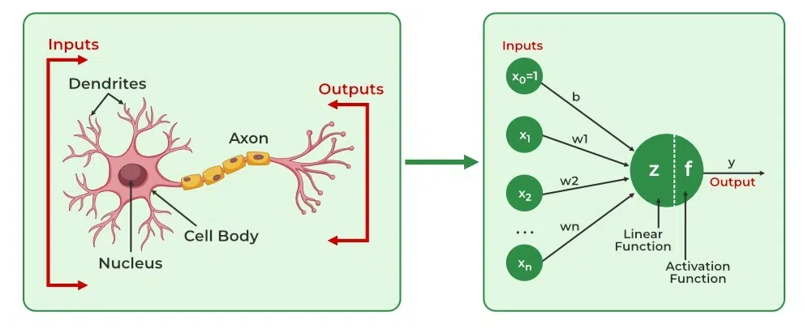

# Lesson 2 An Introduction to TensorFlow

[TensorFlow](https://www.tensorflow.org/) is an open-source, versatile deep learning framework developed by Google, designed to facilitate the development, training, and deployment of machine learning models, particularly neural networks, across a wide range of platforms and applications. Initially released in 2015, TensorFlow provides a comprehensive ecosystem for building models using high-level APIs like [**Keras**](https://keras.io/) for rapid prototyping, as well as low-level APIs for fine-grained control over neural network operations. It supports a variety of architectures, including Multi-Layer Perceptrons (MLPs), Convolutional Neural Networks (CNNs), Recurrent Neural Networks (RNNs), and Transformers, making it suitable for tasks like image classification, natural language processing, and time-series analysis. TensorFlow’s core is built around **tensors** (multi-dimensional arrays) and a **computation graph** that enables efficient execution of mathematical operations, optimized for parallel processing on GPUs and TPUs. It supports **automatic differentiation** for backpropagation, enabling gradient-based optimization techniques like Adam or Stochastic Gradient Descent. TensorFlow also offers **TensorFlow Extended (TFX)** for end-to-end MLOps pipelines, **TensorFlow Lite** for mobile and edge device deployment, and **TensorFlow Serving** for production-grade model serving. With robust support for distributed training via tools like [**Horovod**](https://horovod.ai/), cross-platform compatibility (Windows, macOS, Linux, and cloud platforms like AWS, GCP), and integration with libraries like [**NumPy**](https://numpy.org/) and [**Pandas**](https://pandas.pydata.org/), TensorFlow is widely used in academia and industry. Its active community, extensive documentation, and pre-trained models (e.g., via TensorFlow Hub) make it accessible to beginners while providing the scalability needed for enterprise-level applications.

## First Look at a Neural Network 
A neural network (NN) is a biologically inspired computational model designed to recognize patterns and make decisions based on input data. At its most basic level, a neural network consists of three fundamental components:  
1. **Input Layer** – The entry point for raw data (e.g., pixels in an image, words in a text), where each input node represents a feature.  
2. **Hidden Layers** – Intermediate layers where computation occurs, each comprising **neurons** (or nodes) that apply a weighted sum of inputs followed by a **nonlinear activation function** (e.g., ReLU, Sigmoid) to introduce complexity and enable learning.  
3. **Output Layer** – Produces the final prediction (e.g., class probabilities in classification, a continuous value in regression).  

The network **learns** by adjusting weights via **backpropagation**, where errors from predictions are propagated backward, and optimization algorithms (e.g., **SGD, Adam**) minimize a **loss function** (e.g., cross-entropy, MSE). A simple **feedforward neural network (FNN)** processes data in one direction, while more advanced architectures like **CNNs** (for spatial data) and **RNNs** (for sequential data) introduce specialized layers (e.g., convolutions, recurrent cells).  

Key concepts in a first encounter include:  
- **Forward Pass**: Data flows from input to output, generating predictions.  
- **Training Loop**: Iterative weight updates using batches of data (**mini-batch gradient descent**).  
- **Overfitting Prevention**: Techniques like **dropout** and **L2 regularization**.  

Neural networks form the backbone of deep learning, enabling tasks like image recognition, machine translation, and game-playing AI. Their power lies in **hierarchical feature learning**—transforming raw input into abstract representations through successive layers.

## Data Representations for Neural Networks

Neural networks process data in structured numerical formats, requiring careful preprocessing to ensure compatibility with model architectures. The choice of representation significantly impacts learning efficiency and performance. Below are the key data types and their typical encodings:

**1. Structured Data (Tabular)**
- **Format**: Tables (CSV, DataFrames) with rows as samples and columns as features.
- **Preprocessing**:
  - **Numerical Features**: Scaled (MinMax, Standard) to normalize ranges.
  - **Categorical Features**: Encoded via one-hot or embeddings (high-cardinality).
  - **Missing Values**: Imputed (mean/median) or masked.
- **Example**: Predicting house prices from square footage, bedrooms, and location.

**2. Images**
- **Format**: Grids of pixels (height × width × channels).
  - Grayscale: 1 channel (e.g., MNIST).
  - RGB: 3 channels (e.g., CIFAR-10).
- **Preprocessing**:
  - Normalization (e.g., pixel values rescaled to [0, 1] or [-1, 1]).
  - Augmentation (rotation, flipping) for robustness.
- **Representation**: 4D tensors (batch_size × height × width × channels) for CNNs.

**3. Text**
- **Format**: Sequences of tokens (words, characters, subwords).
- **Preprocessing**:
  - **Tokenization**: Splitting text into units (e.g., BPE for GPT).
  - **Vectorization**:
    - **Bag-of-Words (BoW)**: Count-based (sparse).
    - **Embeddings**: Dense vectors (Word2Vec, GloVe, BERT).
    - **Sequence Encoding**: RNNs/Transformers use integer indices (vocabulary mapping).
- **Representation**:
  - 2D tensors (batch_size × sequence_length) for embeddings.
  - 3D for attention masks (Transformer models).

**4. Time Series/Sensor Data**
- **Format**: Ordered sequences (timestamp × features).
- **Preprocessing**:
  - Normalization (per-feature scaling).
  - Windowing (rolling windows for RNNs/CNNs).
  - Handling missing timestamps (interpolation).
- **Representation**: 3D tensors (batch_size × timesteps × features).

**5. Audio**
- **Format**: Waveforms (time-domain) or spectrograms (frequency-domain).
- **Preprocessing**:
  - **Waveforms**: Sample-rate normalization, padding/trimming.
  - **Spectrograms**: STFT/Mel-spectrograms for CNNs (2D time-frequency plots).
- **Representation**:
  - Waveforms: 2D (batch_size × samples).
  - Spectrograms: 3D (batch_size × frequency_bins × time_steps).

**6. Graph Data**
- **Format**: Nodes + edges (e.g., social networks, molecules).
- **Preprocessing**:
  - **Node Features**: Numeric attributes or embeddings.
  - **Adjacency Matrix**: Sparse/dense connectivity.
- **Representation**:
  - Graph Neural Networks (GNNs) use tuples of (node_features, edge_index).

**7. Multimodal Data**
- **Format**: Combined inputs (e.g., image + text, video + audio).
- **Preprocessing**:
  - Aligning modalities (temporal synchronization for video-audio).
  - Fusion strategies (early/late fusion, cross-attention).
- **Example**: Video captioning (frames + speech).

**Key Considerations**
- **Dimensionality**: Higher dimensions (e.g., 3D medical images) require memory-efficient representations.
- **Sparsity**: Text/graphs often use sparse formats (COO, CSR) for efficiency.
- **Normalization**: Critical for stable training (avoids exploding gradients).

**Tools for Representation**
- **Libraries**: `TensorFlow` (tf.data), `PyTorch` (Dataset), `scikit-learn` (preprocessing).
- **Embeddings**: Pretrained (BERT, ResNet) or learned end-to-end.

## Tensor Operations
Neural networks are fundamentally powered by **tensor operations**—efficient mathematical computations performed on multi-dimensional arrays of numerical data. These operations form the backbone of forward propagation, backpropagation, and optimization, enabling models to learn from data. Below is a breakdown of the critical tensor operations that drive neural networks:

**1. Tensor Basics**  
- **Definition**: Tensors are generalized arrays with *rank* (number of dimensions):  
  - **Scalar**: Rank-0 (single value, e.g., loss).  
  - **Vector**: Rank-1 (e.g., biases in a layer).  
  - **Matrix**: Rank-2 (e.g., weight matrix).  
  - **Higher-rank**: Rank-3+ (e.g., batches of images, time-series data).  
- **Memory Layout**: Contiguous blocks optimized for GPU/TPU parallelism.  

**2. Core Operations**  
**(a) Element-wise Operations**  
- **Description**: Apply a function independently to each element.  
- **Examples**:  
  - Addition/Subtraction: `A + B` (broadcasting allowed).  
  - Activation functions: `ReLU(x) = max(0, x)`, `Sigmoid(x)`.  
  - Scaling: `α * W` (learning rate updates).  
**(b) Matrix Multiplication (Dot Product)**  
- **Key Role**: Connects layers via weight matrices.  
- **Operation**: `Y = X · W + b`, where:  
  - `X`: Input (batch_size × input_dim).  
  - `W`: Weight matrix (input_dim × output_dim).  
  - `b`: Bias vector (broadcasted).  
- **Efficiency**: Optimized via BLAS libraries (cuBLAS for GPUs).  

**(c) Convolution (for CNNs)**  
- **Operation**: Sliding kernels (filters) over input tensors to extract features.  
  - **2D Conv**: `output[i,j] = ∑ (input[i+h, j+w] * kernel[h,w])`.  
  - **Strides/Dilation**: Control spatial downsampling/receptive fields.  
- **Hardware**: Accelerated via cuDNN (NVIDIA) for GPUs.  

**(d) Reduction Operations**  
- **Purpose**: Aggregate values across dimensions.  
- **Examples**:  
  - **Sum/Mean**: `tf.reduce_sum(x, axis=1)` (e.g., pooling layers).  
  - **Max/Argmax**: Used in attention mechanisms.  

**(e) Reshaping & Permutation**  
- **Operations**:  
  - **Reshape**: `(batch_size, 28, 28) → (batch_size, 784)` (flattening for FNNs).  
  - **Transpose**: Swaps axes (e.g., `(H, W, C) → (C, H, W)`).  
  - **Concatenation/Splitting**: Merges/splits tensors along axes.  

**3. Gradient Computation (Autodiff)**  
- **Backpropagation**: Chains tensor operations to compute gradients via:  
  - **Chain Rule**: `∂Loss/∂W = ∂Loss/∂Y * ∂Y/∂W`.  
  - **Automatic Differentiation (AD)**: Frameworks (TensorFlow/PyTorch) track operations in computational graphs.  
- **Key Ops**:  
  - **Gradient Tape (TF)**: Records forward-pass ops for gradient computation.  
  - **Optimizers**: Apply gradients (e.g., `W -= η * ∇W` for SGD).  

**4. Specialized Operations**  
- **Attention Mechanisms (Transformers)**:  
  - **Scaled Dot-Product Attention**: `Q·K^T / √d_k` + softmax.  
- **Recurrent Ops (RNNs)**:  
  - **Gates (LSTM/GRU)**: Sigmoid/tanh for memory control.  
- **Einsum**: Generalized tensor contractions (e.g., `np.einsum('bij,bjk->bik', A, B)`).  

**5. Hardware Acceleration**  
- **GPU/TPU**: Parallelize tensor ops via:  
  - **SIMD (Single Instruction Multiple Data)**: Process batches simultaneously.  
  - **Tensor Cores (NVIDIA)**: Mixed-precision (FP16/FP32) matrix math.  
- **Quantization**: Convert FP32 → INT8 for edge devices (TF Lite).  

**6. Debugging & Optimization**  
- **Common Issues**:  
  - **Shape Mismatches**: `(32, 32, 3)` vs `(64, 64, 3)`.  
  - **NaNs/Infs**: Unstable gradients (clip gradients, normalize inputs).  
- **Tools**:  
  - **TensorBoard**: Visualize computation graphs.  
  - **Profiling**: Identify bottlenecks (e.g., `tf.profiler`).  

**Why It Matters**  
Tensor operations are the "gears" transforming raw data into learned representations. Mastery of these ops is essential for:  
- **Custom Layer Design** (e.g., novel attention mechanisms).  
- **Performance Tuning** (memory/FLOP optimization).  
- **Debugging** (gradient flow analysis).  

Frameworks abstract these details, but understanding the underlying math unlocks the ability to innovate and optimize models at scale.  
**Example**: A ResNet-50’s forward pass executes ~3.8 billion tensor ops per image—efficient implementation is non-negotiable for real-world deployment.

## The Engine of Neural Networks: Gradient-Based Optimization  

At the core of every neural network lies a powerful optimization process driven by **gradient-based learning**. This mechanism enables models to iteratively adjust their parameters (weights and biases) to minimize a **loss function**, transforming raw input data into meaningful predictions. Here’s a deep dive into how gradient-based optimization powers neural networks:

**1. The Gradient Descent Framework**  
Neural networks learn by **gradient descent**, an iterative process that updates parameters in the direction of steepest loss reduction:  

- **Step 1: Forward Pass**  
  - Compute predictions: \( \hat{y} = f(X; \theta) \), where \( \theta \) represents model parameters.  
  - Calculate loss \( \mathcal{L}(\theta) \) (e.g., cross-entropy, MSE) between predictions and true labels.  

- **Step 2: Backward Pass (Backpropagation)**  
  - Compute gradients \( \nabla_\theta \mathcal{L} \) (partial derivatives of loss w.r.t. each parameter).  
  - Propagate errors backward through the network using the **chain rule**.  

- **Step 3: Parameter Update**  
  - Adjust weights: \( \theta \leftarrow \theta - \eta \nabla_\theta \mathcal{L} \), where \( \eta \) is the learning rate.  

**2. Key Components of Gradient-Based Learning**  

**(a) The Loss Function**  
- Defines the objective (e.g., MSE for regression, cross-entropy for classification).  
- Must be differentiable for gradient computation.  

**(b) Gradients and Partial Derivatives**  
- Gradients indicate:  
  - **Direction**: Which way to adjust parameters to reduce loss.  
  - **Magnitude**: How strongly to adjust them.  
- Computed via **automatic differentiation (autodiff)**, which decomposes complex functions into elementary ops (e.g., matrix multiplies, activations).  

**(c) Optimization Algorithms**  
- **Stochastic Gradient Descent (SGD)**: Basic but noisy; updates per mini-batch.  
- **Momentum**: Accumulates past gradients to dampen oscillations.  
- **Adaptive Methods (Adam, RMSprop)**: Per-parameter learning rates for faster convergence.  

**3. Why Gradients?**  
- **Efficiency**: Gradients provide the locally optimal direction for minimizing loss.  
- **Scalability**: Backpropagation computes gradients in \( O(N) \) time (same as forward pass).  
- **Generality**: Applicable to any differentiable architecture (CNNs, RNNs, Transformers).  

**4. Challenges & Solutions**  

| **Challenge**               | **Solution**                          |  
|-----------------------------|---------------------------------------|  
| **Vanishing/Exploding Gradients** | Normalized init (Xavier, He), skip connections (ResNet), gradient clipping. |  
| **Local Minima/Saddle Points**   | Momentum, adaptive optimizers (Adam). |  
| **Slow Convergence**             | Learning rate schedules, warmup.      |  
| **Overfitting**                  | Regularization (L2, dropout), early stopping. |  

**5. Advanced Topics**  
- **Second-Order Optimization**: Uses Hessian (curvature) for faster convergence (e.g., L-BFGS), but computationally expensive.  
- **Meta-Learning (MAML)**: Optimizes for gradient-based adaptability.  
- **Implicit Gradients**: Used in differentiable programming (e.g., optimizing hyperparameters).  

**6. The Big Picture**  
Gradient-based optimization is the **engine** that:  
- Powers **deep learning’s scalability** (millions of parameters).  
- Enables **end-to-end learning** (no manual feature engineering).  
- Drives **state-of-the-art AI** (from GPT to Stable Diffusion).  

**Without gradients, neural networks would be static function approximators—unable to learn from data.**  

**Example: Training a CNN**  
1. **Forward Pass**: Image → Conv layers → Prediction → Loss.  
2. **Backward Pass**: Gradients flow from loss → Conv filters.  
3. **Update**: Filters adjust to detect edges/textures better.  

**Key Takeaways**  
- Gradients bridge **prediction errors** to **parameter updates**.  
- Optimization algorithms balance **speed** and **stability**.  
- Understanding gradients is essential for **debugging** and **designing new architectures**.  

Gradient-based optimization is not just a tool—it’s the **foundation of modern neural networks**.

## Hands-On [Colab](https://colab.research.google.com/)

[Lab001 Introduction to TensorFlow in Google Colab](https://colab.research.google.com/drive/1RYQ8XnKuGS7boNMNSX6-HUUO_XXaXtJO?usp=drive_link)

[Lab002 Structured Data (Tabular) Classification](https://colab.research.google.com/drive/1ZXFUROCi2HjGqOSFYBnExheSU2zVD6sL?usp=drive_link)

[Lab003 Image Classification with CNNs](https://colab.research.google.com/drive/1pAe4bT9rjn7dwjia5D_ePXo45kMO2qvo?usp=drive_link)

[Lab004 Text Classification with NLP](https://colab.research.google.com/drive/1hcebtZ6BKg1TlH78c2-rnZHVprtyh6jg?usp=drive_link)
