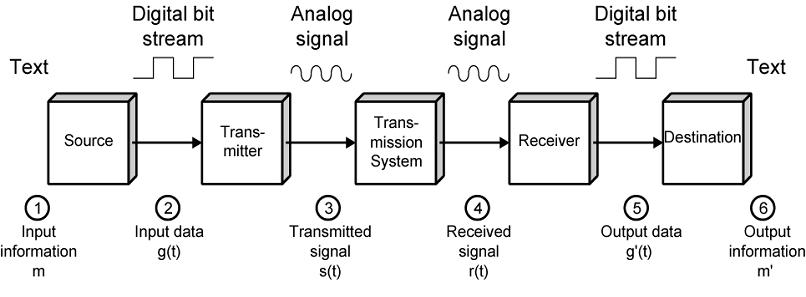

# Lesson 01 Computer Communication Essentials
Computer communication refers to the process of exchanging data, information, and instructions between two or more computers, devices, or systems through a communication link, such as a cable, wireless link, or network. This process enables computers to share resources, exchange information, and collaborate on tasks, facilitating a wide range of applications, including email, file transfer, remote access, and online services. Computer communication involves various technologies, including networking protocols, such as TCP/IP, data transmission methods, such as packet switching, and communication devices, such as modems, routers, and switches. Effective computer communication requires careful consideration of factors, such as data transfer rates, transmission reliability, network security, and compatibility between different systems and devices. As computer communication continues to evolve, new technologies, such as cloud computing, Internet of Things (IoT), and 5G networks, are emerging to support an increasingly interconnected and data-driven world.

## Process of Communication
The process of communication involves a sender, receiver, and communication media, with analog and digital conversion playing a crucial role. The sender creates the information to be transmitted, which is then converted into digital form through analog-to-digital conversion (ADC) if necessary. The digital information is encoded, modulated onto a carrier signal, and transmitted through the communication media, such as a cable or wireless link. The signal propagates through the media, potentially being affected by noise or interference, before being received by the receiver. The receiver demodulates the signal, decodes the information, and converts it back into analog form through digital-to-analog conversion (DAC) if necessary, before presenting the information to the user.

## Analog and Digital Conversion

### Analog-to-Digital Conversion (ADC)
Analog-to-Digital Conversion (ADC) is the process of converting an analog signal, which is a continuous signal with a range of values, into a digital signal, which is a discrete signal with a finite number of values. ADC is a crucial step in many modern technologies, including digital communication systems, audio and video processing, and medical imaging.

The ADC process involves sampling the analog signal at regular intervals, quantizing the sampled values, and encoding the quantized values into a digital format. The resulting digital signal is a representation of the original analog signal, but with a finite number of values.

### Types of ADCs
There are several types of ADCs, including:
1. Flash ADC: A high-speed ADC that uses a parallel conversion process.
2. Successive Approximation ADC: A widely used ADC that uses a sequential conversion process.
3. Delta-Sigma ADC: A high-resolution ADC that uses a feedback loop to achieve high accuracy.

### Applications of ADCs
ADCs are used in a wide range of applications, including:
1. Audio processing: ADCs are used to convert analog audio signals into digital format for processing and storage.
2. Image processing: ADCs are used to convert analog image signals into digital format for processing and storage.
3. Medical imaging: ADCs are used to convert analog medical imaging signals into digital format for processing and storage.
4. Communication systems: ADCs are used to convert analog communication signals into digital format for transmission and reception.

### The advantages of ADCs include:
1. Improved accuracy: ADCs can provide high accuracy and resolution, making them suitable for applications where precision is critical.
2. Increased flexibility: ADCs can be used in a wide range of applications, from audio processing to medical imaging.
3. Enhanced processing capabilities: ADCs enable the use of digital signal processing techniques, which can provide significant improvements in signal quality and processing capabilities.

