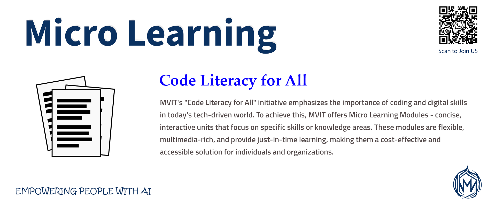

# Micro Learning Modules
Micro Learning Modules are bite-sized, self-contained learning units that focus on a specific skill or knowledge area, designed to be consumed in a short period of time. These modules are tailored to meet the needs of modern learners, who are often overwhelmed by information and have limited time to dedicate to learning. Micro Learning Modules are usually interactive, engaging, and multimedia-rich, incorporating elements such as videos, animations, gamification, quizzes, and simulations to enhance the learning experience. They can be easily accessed on-demand, via mobile devices, desktops, or Learning Management Systems (LMS), allowing learners to fit learning into their busy schedules. By providing just-in-time learning, Micro Learning Modules enable learners to quickly acquire new skills, refresh their knowledge, or address specific performance gaps, ultimately leading to improved job performance, increased productivity, and enhanced career development. Moreover, Micro Learning Modules offer organizations a flexible and cost-effective way to deliver training, as they can be easily updated, modified, or expanded to meet changing business needs.

## M100 Connecting the Dots

[MVC-143 Microsoft Office Essentials for Web Developers](OMCDEV/Readme.md)

[MVC-144 Secrets of Programming with Math and Logic](SPML/Readme.md)

[MVC-15 Introduction to JavaScript Programming](Introduction_to_JavaScript_Programming/Readme.md)

[MVC-10 Digital Literacy and Online Professional Skills](DLOPS/Readme.md)

[MVC-149 Adobe Illustrator for Web Design](AdobeAi/Readme.md)

## M200 Core Web Technologies

[MVC-93 HTML Fundamentlals](HTML_Fundamentals/Readme.md)

[MVC-94 Cascading Style Sheets - CSS](CSS/Readme.md)

[MVC-146 Mastering CSS Animation](CSSAnimation/Readme.md)

[MVC-111 Version Control and Collaboration](VCS/Readme.md)

[MVC-28 Typescript Programming](TS/Readme.md)

[MVC-100 Tailwind CSS](TW/Readme.md)

[MVC-26 Next.js and Vercel Deployment](NextVercel/Readme.md)

[MVC-148 Advanced Techniques for Improved Search Engine Rankings](SEO/Readme.md)

## M300 Fullstack Fundamentals

[MVC-138 JavaScript DOM and Performance Optimization](DOM/Readme.md)

[MVC-13 Database Management Systems -DBMS](DBMS/Readme.md)

[MVC-114 Responsive Design with Figma](RDS/Readme.md)

[MVC-21 Data Structures and Algorithms](DSA/Readme.md)

[MVC-105 PostgreSQL and Next.js Full Stack Applications](PsqlNext/Readme.md)

[MVC-120 Bootstrap](Bootstrap/Readme.md)

## M400 Programming Trinity

[MVC-06 Introduction to Python Programming](Introduction_to_Python_Programming/Readme.md)

[MVC-96 PHP Programming](PHP/Readme.md)

[MVC-141 C#.Net Programming](Csharp/Readme.md)

[MVC-119 API Development with Next](APINext/Readme.md)

[MVC-11 AI Software Engineering](AISE/Readme.md)

[MVC-145 C Programming for Problem-Solving and Algorithmic Thinking](CLang/Readme.md)

## M500 Cyber Shield APIs Design and Development

[MVC-501 Building Real-Time APIs with FastAPI]()

[MVC-502 Building RESTful APIs with MEAN Stack]()

[MVC-503 MERN Stack APIs From Scratch to Deployment]()

[MVC-504 Full Stack Development with Laravel]()

[MVC-505 Designing, Implementing, and Testing Secure APIs](CSF/Readme.md)

## M600 Containerization and Cloud Computing

[MVC-601 Serverless Deployment (AWS Lambda)]()

[MVC-602 Containerization (Docker)]()

[MVC-603 Orchestration (Kubernetes)]()

[MVC-604 Authentication (OAuth, JWT, Next AUTH)]()

[MVC-605 Cloud Computing Fundamentals](CCF/Readme.md)

[MVC-606 Operating Systems]()

## M700 Mathematical Concepts for Programming

[MVC-701 Discrete Mathematics for Programming](DMP/Readme.md)

[MVC-702 Linear Algebra for Machine Learning](LAML/Readme.md)

[MVC-703 Calculus for Optimization](CFO/Readme.md)

[MVC-704 Probability and Statistics for Data Science](SDS/Readme.md)

[MVC-705 Artificial Intelligence and Machine Learning]()

[MVC-706 Introduction to Blockchain Technology](BC/Readme.md)

## M800 Autonomous AI and Agentic Web

[MVC-801 Introduction to Agentic AI Application Development](AgenticAI/Readme.md)

[MVC-802 AI Agents Development with Next.js](NextAI/Readme.md)

[MVC-803 Building Intelligent Cloud Native Microservices](Microservices/Readme.md)

[MVC-804 Intelligent Humanoid Robotics and Physical AI Systems](IHR/Readme.md)

[MVC-805 Multi-Agent Systems with CrewAI](CrewAI/Readme.md)

## M900 Technical Stack for Fullstack AI Development

[MRE-901 Deep Learning with TensorFlow](MRE001/Readme.md)

[MRE-902 PyTorch for AI and Machine Learning Engineers](MRE002/Readme.md)

[MRE-903 Python Machine Learning with Scikit-learn](MRE003/Readme.md)

[MRE-904 Python Numerical Computing with NumPy](MRE004/Readme.md)

[MRE-905 SciPy for Engineers and Scientists](MRE005/Readme.md)

[MRE-906 Python Data Analysis with Pandas](MRE006/Readme.md)

[MRE-907 Containerization with Docker](MRE007/Readme.md)

[MRE-908 Building Data Visualization Apps with Streamlit:](MRE008/Readme.md)

[MRE-909 Linux Fundamentals for Developers](MRE009/Readme.md)

[MRE-910 Building, Deploying, and Managing Modern Applications with Kubernetes](MRE010/Readme.md)

[MRE-911 Building RESTful APIs with Flask](MRE011/Readme.md)

[MRE-912 Building Scalable Web Applications with Django](MRE012/Readme.md)

[MRE-913 Building Real-Time APIs with FastAPI](MRE013/Readme.md)

[MRE-914 Building Scalable Applications with UV](MRE014/Readme.md)

[MRE-915 React Components, Props, and State](MRE015/Readme.md)

[MRE-916 Building Enterprise-Level Applications with TypeScript](MRE016/Readme.md)

[MRE-917 Building RESTful APIs with Express.js](MRE017/Readme.md)

[MRE-918 Creating, Optimizing, and Troubleshooting SQL Stored Procedures](MRE018/Readme.md)

[MRE-919 Creating, Managing, and Contributing to GitHub Repositories](MRE020/Readme.md)

[MRE-920 Chart.js for Data Visualization and Integration into Web Applications](MRE021/Readme.md)

[MRE-921 Creating, Customizing, and Animating Data Visualizations with D3.js](MRE022/Readme.md)

[MRE-922 Building Customizable Data Visualizations with Matplotlib](MRE023/Readme.md)

## M1 Fullstack AI Developer

[MRE-101 Prompt Engineering for Developers](MRE101/Readme.md)

[MRE-301 Building RAG Agents with LLMs](MRE301/Readme.md)

## M2 Fullstack AI Engineer

[MRE-700 Prompt Engineering and LLMs](PE/Readme.md)

[MRE-701 Building AI Agents and Applications](AutoGen/Readme.md)
