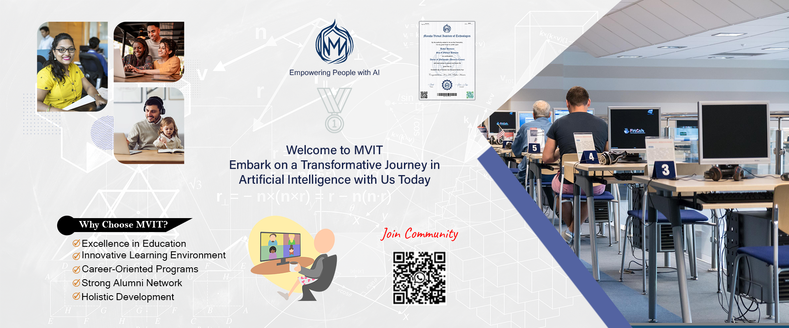

# [Mansha Virtual Institute of Technologies (MVIT)](https://www.mvut.us/)

### Empowering People with AI
Mansha Institute of Technologies (MVIT) is a beacon of excellence in technology education, empowering individuals to unlock their full potential. By offering comprehensive programs in Computer Science from primary to PhD levels, MVIT fosters a culture of logical inquiry, human compassion, and intelligent innovation. With a focus on academic excellence, integrity, and empathy, MVIT produces well-rounded professionals equipped to drive technological progress and positively impact society. Through its certifications and non-academic degrees, MVIT bridges the gap between theory and practice, preparing students for successful careers and lifelong learning. By joining MVIT, individuals become part of a vibrant community that values diversity, creativity, and entrepreneurship, shaping the next generation of technology leaders.
We Ignite Curiosity and Illuminate Possibilities. We empower people by offering Online and On-Site Career Building Opportunities and Lifelong Learning, Leading in Computer Science, Information Technology, Business Management, Custom Software, Web Application, Communication Skill, Leadership Training and Research Methodologies.

## Professional Certifications
Elevate your career prospects with our Professional Certifications in AI Engineering and Fullstack Development. Designed to validate your expertise and skills, these certifications demonstrate your proficiency in cutting-edge technologies and methodologies. As an AI Engineer, you'll showcase your ability to design, develop, and deploy intelligent systems, while as a Fullstack Developer, you'll highlight your expertise in building comprehensive web applications from front-end to back-end. By earning these certifications, you'll unlock new opportunities, enhance your credibility, and stay ahead in the competitive tech industry.

[Click to view all Certifications ](Professional_Certifications/Readme.md)

## United School of Artificial Intelligence (USAI) 
The **United School of Artificial Intelligence (USAI)** is presented as an **innovative early childhood education program** by Mansha Virtual Institute of Technologies (MVIT). Its core mission is to **introduce artificial intelligence and computer science technologies to kindergarten children**. This unique initiative aims to **foster creativity, critical thinking, and problem-solving skills** in these young learners. Experienced educators provide **onsite training and education** within a **nurturing environment** designed to spark curiosity and excitement. 

[Kindergarten (K.G.) STEM Entrepreneurs]()

## Micro Learning Modules
Micro Learning Modules are concise, bite-sized learning units that focus on a specific skill or topic, designed to be completed in a short amount of time. They are flexible, interactive, and provide just-in-time learning, allowing learners to retain more information, stay engaged, and manage their time effectively. Micro Learning Modules also offer a cost-effective solution for learning and development, making them an attractive option for individuals and organizations alike.

[List of Micro Modules](Courses/Readme.md)

Recently, Learning AI is the crucial part of all modern professions. MVIT is offering courses along with the latest state of the art. Join MVUT and start building your career as Software Engineer, Data Scientist, Graphic Designer and Entrepreneur and become partner of digital literacy. 

[APPLY NOW!](https://www.mvut.us/pages/apply) 
